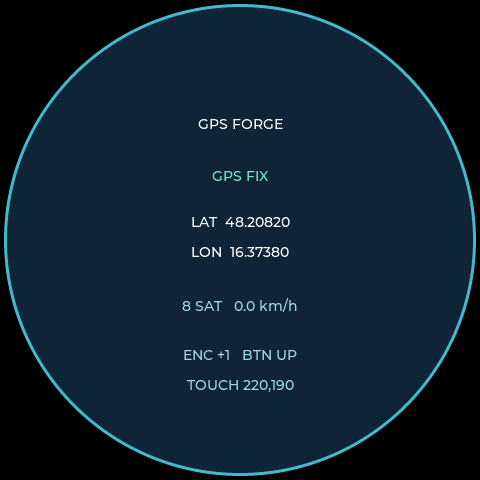

<!--
SPDX-FileCopyrightText: 2026 GPS Forge contributors
SPDX-License-Identifier: Apache-2.0
-->

# GPS Forge

Development platform for an ESP32-S3 rotary display and an external GPS receiver. It provides QEMU display, GPS and control input backends so application developers can build and test their own UI before running it on the physical device. The included LVGL screen is a diagnostic example.

The target setup is:

- ELECROW CrowPanel 2.1-inch HMI ESP32 Rotary Display (480x480)
- ESP32-S3
- u-blox NEO-6M / NEO-6MV2 GPS receiver
- Rotary encoder and capacitive touch input from the CrowPanel
- ESP-IDF 6.1
- Espressif QEMU for ESP32-S3

## Goals

GPS Forge provides a hardware-independent ESP32-S3 development platform. GPS/NMEA and virtual controls are the first reference simulators, and the included LVGL GPS screen is a reference application. Application developers own the final UI and interaction design for the round 480x480 display.

The virtual development setup emulates the ESP32-S3 and injects NMEA and virtual control events into UART1 over a TCP chardev. The host GPS simulator can hold a fixed position or replay a GPX route; it also accepts encoder, button and touch commands from a separate control client.

QEMU support includes a virtual 480x480 RGB framebuffer and an LVGL diagnostic screen that displays GPS and control events.

The v1 scope and acceptance criteria are documented in [V1_SCOPE.md](V1_SCOPE.md). v1 intentionally proves the platform boundary with one complete GPS reference setup; additional peripheral simulators and plugin infrastructure can follow later.

## Architecture

```text
Host
  controls_sim.py --TCP :5557--> gps_sim.py (fixed GPS or GPX route)
      |
      | NMEA + !control lines on TCP :5556
      v
QEMU ESP32-S3
  UART0 ------------------------> ESP-IDF monitor (:5555)
  UART1
      +-- GPS service -> NMEA parser -> gps_fix_t
      +-- controls parser -> controls event queue
  LVGL diagnostic UI -> display API -> QEMU RGB framebuffer

Physical hardware
  NEO-6M --UART--> ESP32-S3
  CrowPanel display <---------- Application / UI
  Encoder / touch ------------> CrowPanel board backend -> controls event API
```

The NMEA parser does not depend on UART, FreeRTOS, or QEMU. UART handling stays in the GPS service. The `!` control messages on UART1 are only a QEMU transport; the physical encoder, button and CST826 touch backend feed the same controls event API without using the GPS UART.

## Repository Layout

```text
.
├── V1_SCOPE.md                    v1 boundary and acceptance criteria
├── firmware/
│   ├── CMakeLists.txt
│   ├── main/
│   │   ├── CMakeLists.txt
│   │   └── firmware.c
│   └── components/
│       ├── controls/              Virtual control event queue/parser
│       ├── crowpanel_board/       PCF8574, CST826 and physical input backend
│       ├── display/               QEMU and CrowPanel RGB backends
│       ├── gps/                   UART and NMEA service
│       └── ui/                    Reference LVGL diagnostic application
└── sim/
    ├── controls/                  Host control client
    └── gps/                       GPS simulator, sample GPX route and tests
```

## Development Environment

The project currently uses:

```text
ESP-IDF:  v6.1
Target:   esp32s3
QEMU:     9.2.2 (esp_develop_9.2.2_20260417)
Flash:    16 MB
PSRAM:    8 MB octal, 80 MHz
```

ESP-IDF is managed with Espressif Installation Manager (`eim`). Start a shell with the ESP-IDF environment activated:

```bash
eim shell v6.1
```

The expected QEMU binary is `qemu-system-xtensa`. The installed emulator can be checked with:

```bash
qemu-system-xtensa --version
qemu-system-xtensa -M help | grep -i esp
```

The machine list should contain `esp32s3`.

## Installing the Host Tools

The GPS and virtual-controls simulators are packaged as installable console
commands. From the project root, install them into a virtual environment:

```bash
python3 -m venv .venv
. .venv/bin/activate
python -m pip install .
```

This provides `gps-sim` and `controls-sim`. The original script paths under
`sim/gps/` and `sim/controls/` continue to work for development and tests. The
ESP-IDF firmware remains a separate target built with `idf.py` from
`firmware/`.

## Building the Firmware

From the firmware directory:

```bash
cd firmware
idf.py build
```

The ESP-IDF target is ESP32-S3. [sdkconfig.defaults](firmware/sdkconfig.defaults) records the 16 MB flash and octal PSRAM settings for a fresh configuration. For a new build directory the target can be selected with:

```bash
idf.py set-target esp32s3
```

The default build selects the QEMU platform. To compile the physical CrowPanel backend, run `idf.py menuconfig`, open **GPS Forge**, and select **Elecrow 2.1-inch CrowPanel V1.0**. The physical backend targets the board's 480x480 ST7701 RGB panel, PCF8574 expander and CST826 touch controller. Its pin mapping follows the [official Elecrow board repository](https://github.com/Elecrow-RD/CrowPanel-2.1inch-HMI-ESP32-Rotary-Display-480-480-IPS-Round-Touch-Knob-Screen).

## Running in QEMU

UART0 is used by the ESP-IDF console/monitor. UART1 is exposed on TCP port 5556 for the host simulator.

From `firmware/`:

```bash
idf.py qemu \
    --graphics \
    --qemu-extra-args "-m 8M -serial tcp:127.0.0.1:5556,server,nowait" \
    monitor
```

The ESP-IDF monitor connects to UART0 while the additional QEMU serial chardev is connected to UART1. The current Espressif QEMU machine does not attach a third `-serial` chardev to UART2, so virtual controls share the UART1 stream through the host simulator.

`-m 8M` sets QEMU's PSRAM capacity to match the target device, as described in [Espressif's ESP32-S3 QEMU guide](https://github.com/espressif/esp-toolchain-docs/blob/main/qemu/esp32s3/README.md). ESP-IDF adds the QEMU octal PSRAM mode from `CONFIG_SPIRAM_MODE_OCT`; the firmware boot log should report an 8 MB PSRAM device and a successful memory test. The 16 MB flash setting also makes `idf.py qemu` generate a 16 MB flash image.

## Reference GPS Simulator

With QEMU running, start the host-side simulator from another terminal in the project root:

```bash
python sim/gps/gps_sim.py
```

The simulator connects to QEMU at:

```text
127.0.0.1:5556
```

and generates NMEA RMC and GGA sentences at the NEO-6M default serial configuration used by the firmware:

```text
9600 baud
8 data bits
no parity
1 stop bit
```

By default, each simulator run starts near a randomly selected major European
city. Use `--lat` and `--lon` together when a repeatable starting position is
needed:

```text
Latitude:   random in Europe
Longitude:  random in Europe
Altitude:   20.0 m
```

To move the simulated receiver continuously, select a speed in km/h and a
bearing in degrees clockwise from north:

```bash
python sim/gps/gps_sim.py --speed 30 --course 90 --interval 1
```

This starts at `--lat`/`--lon`, moves east at 30 km/h, and emits the updated
position every second. Without `--course`, the receiver moves north. `--gpx`
continues to use the route points and takes precedence over these movement
parameters.

To choose a new direction on every interval while keeping the same speed, add
`--random-course`:

```bash
python sim/gps/gps_sim.py --speed 20 --random-course --interval 1
```

Example values shown on the LVGL screen:

```text
GPS FIX
LAT  48.20820
LON  16.37380
8 SAT   0.0 km/h
```

### GPX replay

To move through the included sample route, run the host simulator with:

```bash
python sim/gps/gps_sim.py --gpx sim/gps/routes/sample_route.gpx --interval 1 --loop
```

The simulator reads GPX track or route points in file order. It emits one point per `--interval` seconds and computes speed and course from the distance to the previous point. The first point of each track segment starts at zero speed. GPX timestamps are not used; `--loop` restarts after the last point. GPX `<ele>` supplies altitude, falling back to `--alt` when absent.

### Reference controls simulator

While `gps_sim.py` is running, open a third terminal in the project root:

```bash
python sim/controls/controls_sim.py
```

Enter `left`, `right`, `encoder -3`, `button down`, `button up`, `button click`, `touch 160 200`, `touch tap 160 200`, or `touch up`. For scripts, use repeated `--command` options:

```bash
python sim/controls/controls_sim.py --command 'right' --command 'button click' --command 'touch 160 200'
```

The control client connects to the simulator on TCP port 5557. The simulator forwards complete `!E steps`, `!B 0|1`, and `!T 0|1 x y` lines to QEMU over UART1 without splitting NMEA sentences. Coordinates are 0..479. The diagnostic screen displays the latest encoder position, button state and touch point. This is a command driven input simulator; the QEMU SDL window itself does not inject controls.

Firmware consumers call `controls_start()` once and read `controls_next_event(&event, timeout_ms)` from [controls.h](firmware/components/controls/include/controls.h). A zero timeout polls; `UINT32_MAX` waits indefinitely. The diagnostic UI currently consumes this queue; replace it when building an application UI.

## Replacing the Reference Application

The `firmware/components/ui` component is the v1 reference application, not a
platform requirement. An application can replace its implementation while
keeping the platform services unchanged:

1. Keep `app_main()` initialization in `firmware/main/firmware.c`, or adapt it
   to the application's startup sequence.
2. Replace `ui_start()` with the application's entry point, keeping the
   `display` component as the framebuffer boundary.
3. Read GPS state through `gps_get_latest()` and input events through
   `controls_next_event()`.
4. Leave the host simulators and UART transport unchanged; they exercise the
   same GPS and controls APIs used by the physical backends.

The reference UI is intentionally small so application developers can remove
it and own the screen layout, navigation, and interaction design.

## Simulator Tests

From the project root, run the host-side unit tests with Python and a C compiler (`cc`):

```bash
python -m unittest discover -s sim/gps/tests -v
python -m unittest discover -s sim/controls/tests -v
```

## GPS Component

The public GPS state is represented by `gps_fix_t`:

```c
typedef struct {
    bool valid;

    double latitude;
    double longitude;

    float altitude_m;
    float speed_kmh;
    float course_deg;

    float hdop;

    uint8_t satellites;
    uint8_t fix_quality;
} gps_fix_t;
```

The application-facing API is deliberately small:

```c
esp_err_t gps_start(void);
bool gps_get_latest(gps_fix_t *fix);
```

`gps_start()` configures the GPS transport and starts the FreeRTOS GPS task. `gps_get_latest()` provides a synchronized copy of the most recently decoded GPS state.

### NMEA parser

The parser currently supports:

- Streaming input split across arbitrary UART reads
- Resynchronization on `$`
- NMEA XOR checksum validation
- Rejection of extra data after the checksum, malformed numeric fields and out-of-range coordinates
- Rejection of a malformed sentence without changing the previous fix
- RMC sentences
- GGA sentences
- Different NMEA talker IDs (`GP`, `GN`, etc.)
- Latitude/longitude conversion to decimal degrees
- Speed conversion from knots to km/h
- Altitude, satellite count, HDOP, fix validity and fix quality

UART read boundaries are intentionally not treated as NMEA sentence boundaries. A sentence may arrive over several reads, and a single read may contain several sentences.

## QEMU vs Physical Hardware

Under QEMU, UART1 is wired directly to a QEMU serial chardev, so the firmware currently does not call `uart_set_pin()`.

On physical hardware, the CrowPanel backend initializes the board's I2C devices, display, backlight, encoder, button and touch controller. The display path uses Espressif's ST7701 RGB-panel component and the same LVGL/display API as QEMU. The physical profile has been compile-verified; it still needs validation on an attached board.

The GPS RX pin and physical UART peripheral are menuconfig options (`GPS_UART_RX_GPIO` and `GPS_UART_PORT`). The RX route defaults to unset and the peripheral defaults to UART1. UART0 can be selected for wiring to the board's exposed UART0 connector, but it shares the ESP-IDF console and should only be enabled when that console conflict is understood. When configured, the physical GPS backend calls `uart_set_pin()` for the selected RX GPIO.

The parser and `gps_fix_t` API remain identical in both environments.

## Display Emulation

The QEMU display backend uses Espressif's virtual RGB panel at 480x480 RGB565. LVGL 8.3 renders a round dial using a 40-line draw buffer. The display backend copies changed rectangles into the QEMU framebuffer and refreshes it after each LVGL render cycle.

## Current Platform Status

- QEMU display, GPS simulator, GPX replay and virtual controls: implemented and tested.
- CrowPanel ST7701 display, PCF8574 board control, encoder/button and CST826 touch input: implemented and compile-verified.
- Physical GPS UART route selection is implemented; hardware bring-up remains pending verified wiring and an attached board.

The screen initially shows "WAITING FOR GPS". Once the simulator supplies a valid fix, it displays fix status, latitude, longitude, satellite count and speed. It also shows virtual control events for verification. Pixels outside the circular dial remain black.



The display stack is:

```text
GPS UI
     |
    LVGL
     |
display API
     |
     +-- QEMU: esp_lcd_qemu_rgb -> virtual framebuffer / SDL
     |
     +-- Hardware: CrowPanel ST7701 RGB LCD driver
```

Launch QEMU graphics with `idf.py qemu --graphics`. The display backend is separate from the UI so the same LVGL screens can later run on the physical panel.

## Hardware Notes

The target CrowPanel is based on an ESP32-S3 and provides a 480x480 round IPS display, capacitive touch and a rotary encoder. The target hardware has 16 MB flash and 8 MB PSRAM.

The QEMU development configuration is not a complete electrical emulation of the CrowPanel. The physical LCD, touch controller, GPIO expander and rotary encoder backends are implemented separately; selecting the GPS route and bringing up the board still require verified wiring and hardware testing.

## Current Status

- [x] ESP-IDF 6.1 project targeting ESP32-S3
- [x] ESP32-S3 firmware booting under Espressif QEMU
- [x] UART0 ESP-IDF monitor
- [x] UART1 connected to a host TCP chardev
- [x] Host-side NMEA GPS simulator
- [x] Stateful NMEA stream framing
- [x] NMEA checksum validation
- [x] RMC parsing
- [x] GGA parsing
- [x] Thread-safe `gps_get_latest()` API
- [x] End-to-end simulated GPS fix under QEMU
- [x] 480x480 QEMU RGB framebuffer
- [x] Minimal LVGL GPS screen with simulated live fixes
- [x] Virtual rotary encoder and button events
- [x] Virtual touch events
- [x] GPX route playback
- [x] Invalid/corrupted GPS input tests against the C parser
- [x] Simulator disconnect/reconnect with a new GPS position
- [x] 16 MB flash / 8 MB octal PSRAM target configuration and QEMU boot check
- [x] CrowPanel physical display backend (compile-verified)
- [x] CrowPanel encoder, button and touch backend (compile-verified)
- [x] Configurable physical NEO-6M UART peripheral and RX GPIO
- [ ] Hardware validation

## Physical Hardware Bring-up

1. Connect the NEO-6M TX output to a verified ESP32-S3 RX GPIO and connect grounds. Do not select a GPIO from an unverified pinout.
2. In `idf.py menuconfig`, select **Elecrow 2.1-inch CrowPanel V1.0**, choose `GPS_UART_PORT`, and set `GPS_UART_RX_GPIO` to the verified route.
3. Build and flash with `idf.py build flash monitor`.
4. Confirm the boot log reports the selected GPS UART and that the display, encoder, button and touch input initialize without I2C or panel errors.
5. Check for a valid fix outdoors or with a known NMEA source, then exercise encoder, button and touch events on the diagnostic screen.

This checklist is ready for the board session. Hardware validation remains open until a physical CrowPanel and GPS receiver are connected.

## Products

- CrowPanel rotary ESP32 display: <https://amzn.eu/d/0f7kUAao>
- GPS receiver/antenna: <https://amzn.eu/d/07iuGVVC>

## License

GPS Forge is licensed under the [Apache License 2.0](LICENSE). See
[NOTICE](NOTICE) for project and third-party attribution information.

Third-party dependencies retain their upstream licenses.
